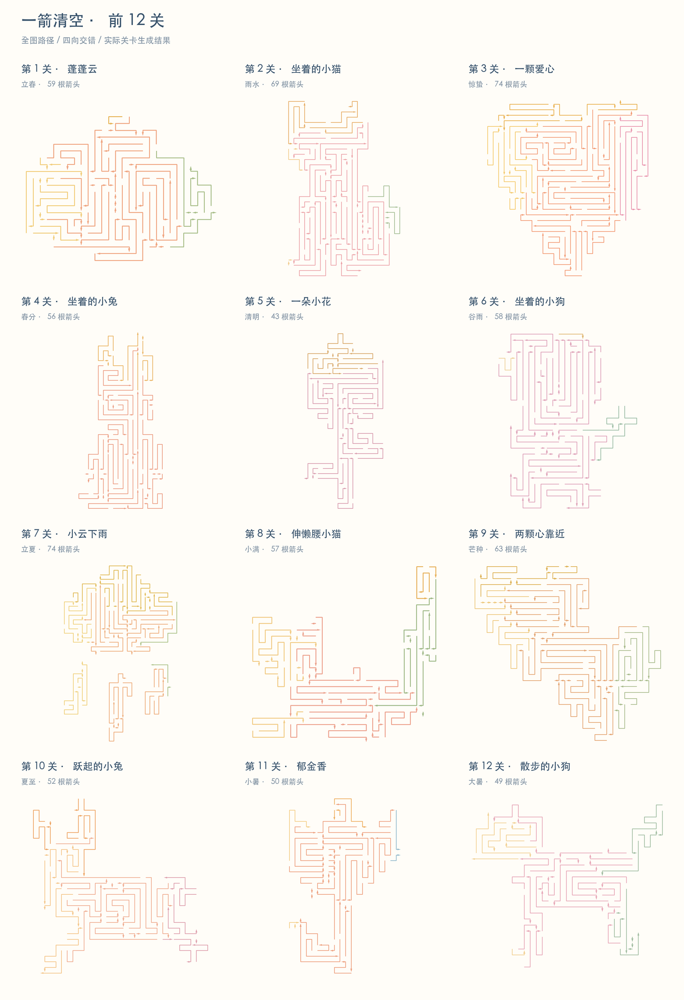

# 一箭清空 · Vector Match

一个独立的微信小游戏原型：玩家点击箭头，让每一根彩色折线沿箭头方向离开图案。关卡图案由算法生成，可以组成云朵、小猫、小狗等治愈系轮廓。



上图由当前生成器的前 12 关实际数据渲染，使用游戏中的节气配色。各关共享全图路径生成算法，横竖折线嵌套、上下左右箭头交错，保留各自的图案轮廓。

## 当前功能

- 微信小游戏目标平台，使用 Cocos Creator 3.8.8。
- 箭头支持点击、拖动、双指缩放和画布平移。
- 点击被挡住的箭头会播放“探出—弹回—抖动—变红”反馈，并扣除一颗心；同一根线重复误点不会重复扣心。
- 参数化 demo：运行时生成云朵、小猫、爱心、小兔、小花、小狗，图案手册可翻页跳关，通关后继续生成。
- 全部关卡使用全图轮廓路径切分，不再拼接小迷宫块；分离的雨滴、花瓣等细节独立生成路径。
- 第 3 关保留 74 根箭头的挑战版，全部 250 个可达状态验证为每步 1–2 个合法出口。其他关卡使用不同的依赖链数量限制，尚未通过玩家数据校准难度。
- 相同关号稳定复现，下一关分帧预生成；已加入跨类别近 24 关的轮廓相似度检查；完整难度评分和全历史视觉去重仍在规划中。
- 六类各六种结构构图，共 36 种，按关号排期；本 demo 不保证无限关卡的轮廓永不重复。
- 关卡颜色按二十四节气循环，每关使用四个有主次关系的暖色系显示色。
- 点击、误点和通关分别使用独立的轻量音效。

## 目录

```text
assets/       Cocos 场景、脚本、关卡和音频资源
configs/      微信小游戏与 Web Mobile 构建配置
design/       配色比较预览
tests/        关卡生成报告
tools/        关卡生成、规则测试和配色预览脚本
prd.md        产品需求文档
technical-design.md  技术方案与可解性设计
infinite-level-generation.md  参数化无限关卡生成方案
```

## 本地验证

项目使用 Node.js 工具脚本，不需要安装运行时依赖即可执行规则测试：

```bash
node tools/test.cjs
```

批量验证参数化 demo 的 120 关（输出 `tests/generator-report.json`）：

```bash
node tools/test-generator.cjs
```

更新 README 的前 12 关预览（Python 需要 Pillow，默认使用 macOS 中文字体）：

```bash
node tools/preview-levels.cjs
python3 tools/render-levels.py /tmp/arrow-preview-levels.json
```

构建微信版本后，核对前 12 关编译产物与源数据一致，并检查存档、误点和缩放：

```bash
node tools/test-wechat-build.cjs
```

重新生成旧版三幅回归关卡并更新报告：

```bash
node tools/generate.cjs
```

生成器会校验箭头路径不重叠、没有自身死结、关卡存在完整解法，并验证任意合法消除顺序不会进入死锁。

## 用 Cocos Creator 打开

使用 Cocos Creator 3.8.8 打开项目目录：

```text
/Users/sunday/Documents/codex-project
```

打开 `assets/scenes/Main.scene` 后，可以在编辑器中预览。微信小游戏构建配置位于 `configs/wechatgame.json`，构建输出目录为 `build/wechatgame/`；该目录已加入 `.gitignore`，不会上传到仓库。

## 颜色来源

节气原始色值参考色韵的二十四节气色卡：

https://cncolor.art/solar-terms

游戏显示色保留节气色相来源，并根据暖白背景和箭头线条的实际显示效果做了人工校准，配置集中在 `assets/scripts/core/SolarTerms.ts`。

无限关卡的轮廓语法、反向可解构造和去重策略见 `infinite-level-generation.md`。
